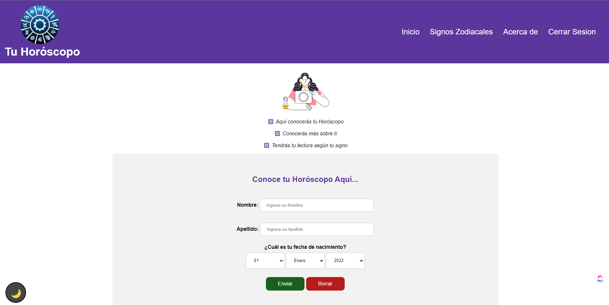

<table align="center"><tr><td colspan="4" align="center" width="9999">

# Horóscopo

Code and dataset for "Sequence-based bacterial small RNAs prediction using ensemble learning strategies"

<p align="center">
  
</p>

</td></tr></table>

## Table of Contents

- [Description](#description)
- [Requirements](#requirements)
- [Instalación](#installation)
- [Team](#team)


## Description

## Requirements

* [PHP ](https://www.python.org/download/releases/2.7/)
* [Xampp](https://www.anaconda.com/products/individual)


It is recommended to use a virtual env for this project. For e.g using conda to create the env.
Is important to notice that the package repDNA is not listed on conda packages, so it is needed to be installed
separately using `pip install repDNA=1.1.4`, inside your virtual env.


## Installation

Clone the repository
```bash
git clone https://github.com/FernandoCutire/zodiaco-app
```

## Team

Fernando Cutire
Gabriel Diaz
Joanthan Gamero