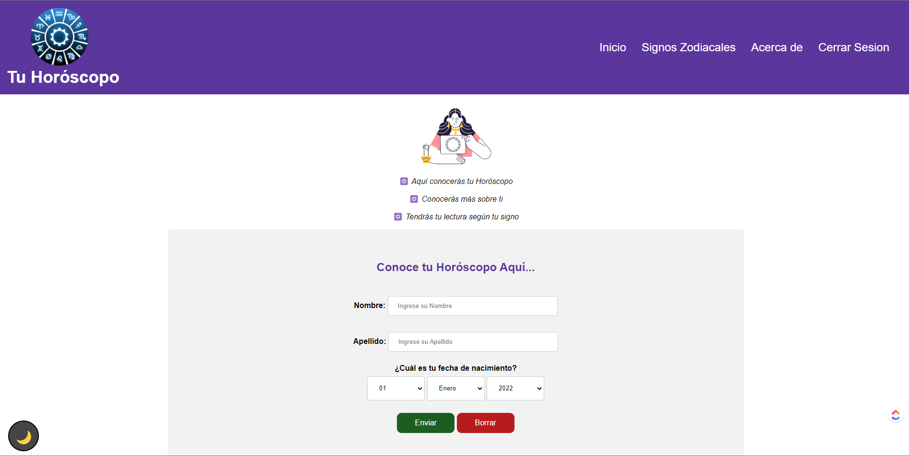

<table align="center"><tr><td colspan="4" align="center" width="9999">

# Horóscopo

Código para el proyecto de Horóscopo digital

<p align="center">
  
</p>

</td></tr></table>

## Tabla de Contenidos

- [Descripción](#description)
- [Requisitos](#requirements)
- [Instalación](#installation)
- [Equipo](#equipo)


## Description

Aplicación que te dice tu horóscopo con tu nombre, apellido y fecha de nacimiento.


Video explicativo [aquí](https://www.loom.com/share/05cf1bfb2e0a4e529cbbe22d6a1a7a59)
<div style="position: relative; padding-bottom: 56.25%; height: 0;">
    <iframe src="https://www.loom.com/embed/05cf1bfb2e0a4e529cbbe22d6a1a7a59" frameborder="0" webkitallowfullscreen mozallowfullscreen allowfullscreen style="position: absolute; top: 0; left: 0; width: 100%; height: 100%;">
</iframe>
</div>


## Requirements

* PHP 
* Xampp


## Instalación

Clona el repositorio
```bash
git clone https://github.com/FernandoCutire/zodiaco-app
```

Coloca la carpeta en tu carpeta htdocs ubicada en xampp

Enciende el servidor apache en tu xampp

Entra a localhost/nombre-carpeta
```bash
Por defecto está http://localhost/zodiaco-app/resources/views/inicio/inicio.php
```

## Equipo

Fernando Cutire
Hellynger St. Rose